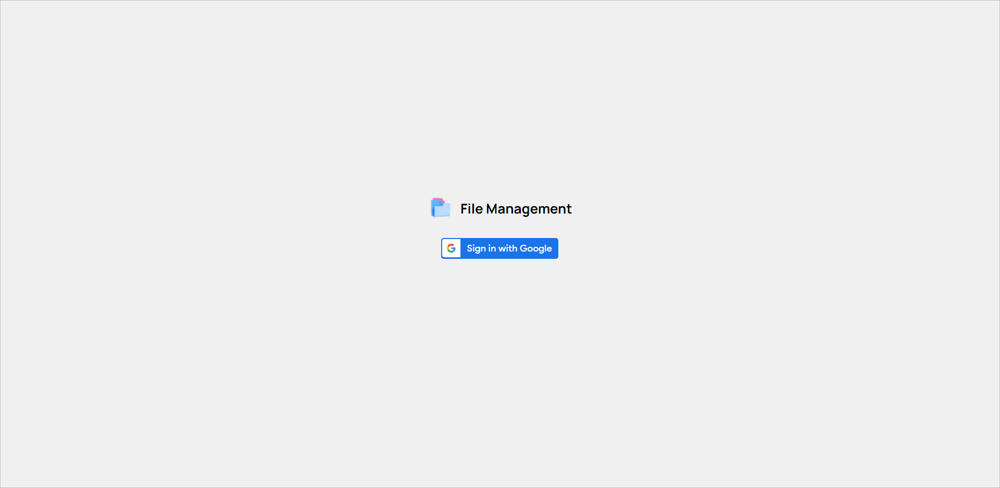
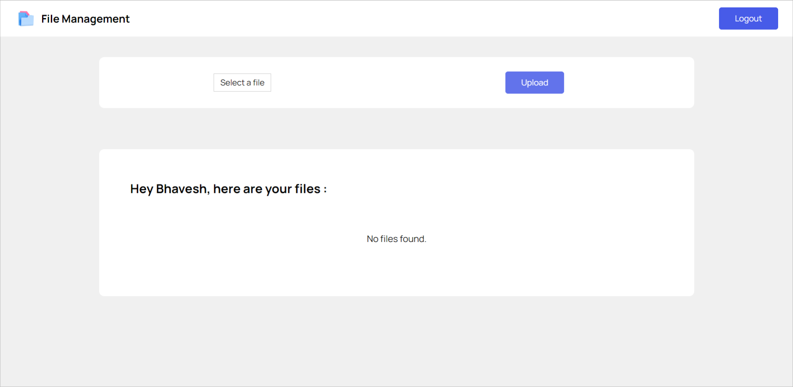
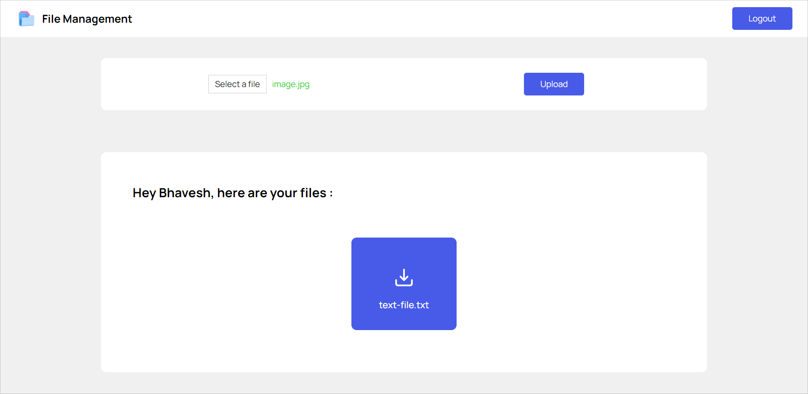
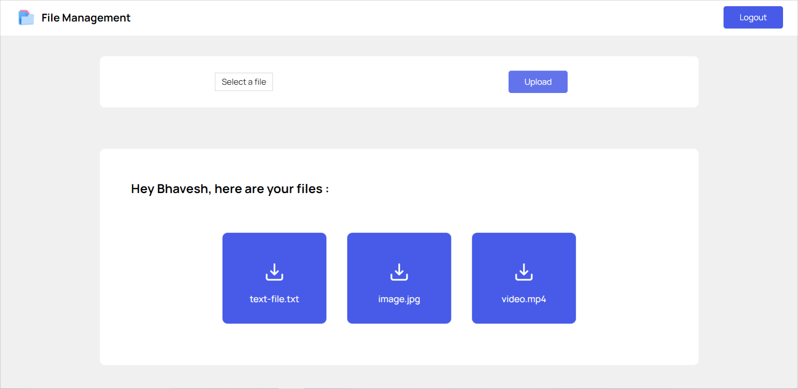
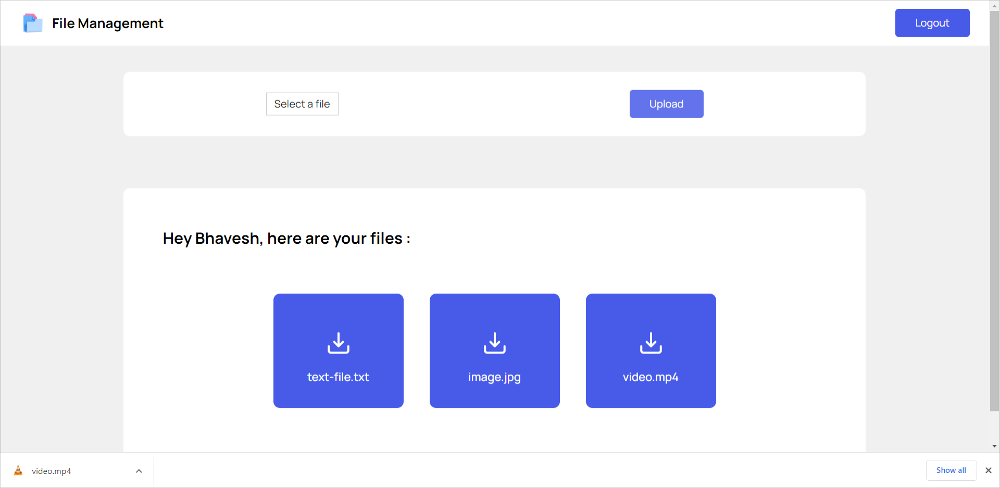

# File Management

Front-end for a modern and lightweight file management application built using the MERN stack.

## Technology stack

- ReactJS
- CSS Modules

## Application Functionalities

- Google Authentication
- Upload file
- View all files
- Download file

## Screenshots

## Note

- You can find the code for this project's back-end [here](https://github.com/bhavesh-gulabani/file-management-server).
